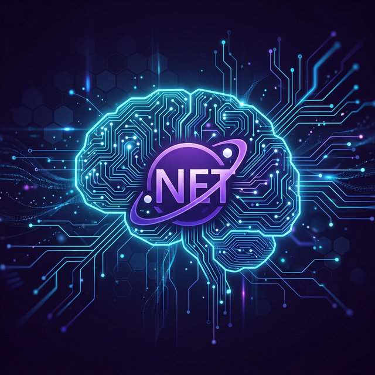
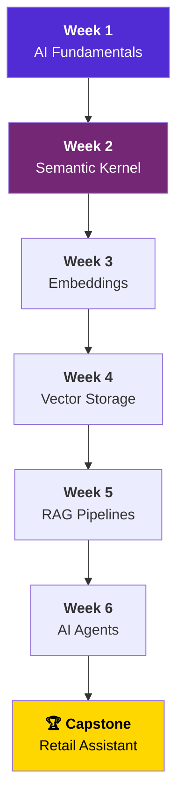

<div align="center">



# 🧠 Dotnet AI Engineer Roadmap
### Master the Modern AI Stack with C# and .NET

[](https://dotnet.microsoft.com/)
[](https://learn.microsoft.com/semantic-kernel/)
[](./LICENSE)
[](./CONTRIBUTING.md)
[](https://github.com/itsrajkumar/AI-Engineer-With-.Net)

---

**Learn to build production-grade AI applications using your existing .NET expertise.**
*Skip the Python-heavy tutorials. Direct path for C# Engineers.*

[Explore Roadmap](#️-roadmap-overview) • [Quick Start](#-getting-started) • [Tech Stack](#️-tech-stack) • [Contribute](./CONTRIBUTING.md)

</div>

---

## 🎯 The Mission
This community-driven roadmap is designed for **.NET developers** who want to transition into **AI Engineering**. We focus on real-world architecture, mapping every AI concept directly to C# code using the latest Microsoft tools.

### Why this roadmap?
- 🚀 **C#-First**: No switching to Python for model orchestration.
- 🏗️ **Architectural Focus**: Learn RAG, Agents, and Vector Storage patterns.
- 🛠️ **Modern Stack**: Built with .NET 8, Semantic Kernel, and Microsoft.Extensions.AI.

---

## 🗺️ Roadmap Overview



---

## 📚 Table of Contents

### [📋 Prerequisites](./00-Prerequisites/README.md)
Setup your development environment, Azure account, and required tools.

---

### [Week 1: AI Fundamentals & The .NET API Layer](./Week-01-AI-Fundamentals-and-DotNet-API-Layer/README.md)
| Day | Topic | Type |
|-----|-------|------|
| 1 | [AI Theory & Terminology](./Week-01-AI-Fundamentals-and-DotNet-API-Layer/Day-01-AI-Theory-and-Terminology/README.md) | 📖 Theory |
| 2 | [Prompt Engineering Basics](./Week-01-AI-Fundamentals-and-DotNet-API-Layer/Day-02-Prompt-Engineering-Basics/README.md) | 📖 Theory + Practice |
| 3 | [Microsoft.Extensions.AI](./Week-01-AI-Fundamentals-and-DotNet-API-Layer/Day-03-Microsoft-Extensions-AI/README.md) | 💻 Code |
| 4 | [Your First API Connection](./Week-01-AI-Fundamentals-and-DotNet-API-Layer/Day-04-First-API-Connection/README.md) | 💻 Code |
| 5 | [System Prompts & Roles](./Week-01-AI-Fundamentals-and-DotNet-API-Layer/Day-05-System-Prompts-and-Roles/README.md) | 💻 Code |

### [Week 2: Microsoft Semantic Kernel — The Orchestrator](./Week-02-Semantic-Kernel-Orchestrator/README.md)
| Day | Topic | Type |
|-----|-------|------|
| 1 | [Kernel Architecture](./Week-02-Semantic-Kernel-Orchestrator/Day-01-Kernel-Architecture/README.md) | 💻 Code |
| 2 | [Semantic Functions](./Week-02-Semantic-Kernel-Orchestrator/Day-02-Semantic-Functions/README.md) | 💻 Code |
| 3 | [Native C# Plugins](./Week-02-Semantic-Kernel-Orchestrator/Day-03-Native-CSharp-Plugins/README.md) | 💻 Code |
| 4 | [Tool Calling (Function Calling)](./Week-02-Semantic-Kernel-Orchestrator/Day-04-Tool-Calling/README.md) | 💻 Code |
| 5 | [State & History Management](./Week-02-Semantic-Kernel-Orchestrator/Day-05-State-and-History/README.md) | 💻 Code |

### [Week 3: Embeddings & Data Processing](./Week-03-Embeddings-and-Data-Processing/README.md)
| Day | Topic | Type |
|-----|-------|------|
| 1 | [Embedding Theory](./Week-03-Embeddings-and-Data-Processing/Day-01-Embedding-Theory/README.md) | 📖 Theory |
| 2 | [Generating Embeddings in .NET](./Week-03-Embeddings-and-Data-Processing/Day-02-Generating-Embeddings-DotNet/README.md) | 💻 Code |
| 3 | [Document Chunking Strategies](./Week-03-Embeddings-and-Data-Processing/Day-03-Document-Chunking/README.md) | 💻 Code |
| 4 | [Cosine Similarity](./Week-03-Embeddings-and-Data-Processing/Day-04-Cosine-Similarity/README.md) | 💻 Code |
| 5 | [Batch Processing Pipeline](./Week-03-Embeddings-and-Data-Processing/Day-05-Batch-Processing-Pipeline/README.md) | 💻 Code |

### [Week 4: Vector Storage & Semantic Search](./Week-04-Vector-Storage-and-Semantic-Search/README.md)
| Day | Topic | Type |
|-----|-------|------|
| 1 | [Vector Database Fundamentals](./Week-04-Vector-Storage-and-Semantic-Search/Day-01-Vector-DB-Fundamentals/README.md) | 📖 Theory |
| 2 | [Document DB & Vector Search](./Week-04-Vector-Storage-and-Semantic-Search/Day-02-Document-DB-Vector-Search/README.md) | 💻 Code |
| 3 | [Relational DB & Vectors](./Week-04-Vector-Storage-and-Semantic-Search/Day-03-Relational-DB-Vectors/README.md) | 💻 Code |
| 4 | [Hybrid Search Integration](./Week-04-Vector-Storage-and-Semantic-Search/Day-04-Hybrid-Search/README.md) | 💻 Code |
| 5 | [C# Repository Pattern for Vectors](./Week-04-Vector-Storage-and-Semantic-Search/Day-05-Repository-Pattern-Vectors/README.md) | 💻 Code |

### [Week 5: Building the RAG Pipeline](./Week-05-RAG-Pipeline/README.md)
| Day | Topic | Type |
|-----|-------|------|
| 1 | [RAG Architecture Review](./Week-05-RAG-Pipeline/Day-01-RAG-Architecture/README.md) | 📖 Theory |
| 2 | [The Retrieval Step](./Week-05-RAG-Pipeline/Day-02-Retrieval-Step/README.md) | 💻 Code |
| 3 | [The Augmentation Step](./Week-05-RAG-Pipeline/Day-03-Augmentation-Step/README.md) | 💻 Code |
| 4 | [End-to-End RAG Implementation](./Week-05-RAG-Pipeline/Day-04-End-to-End-RAG/README.md) | 💻 Code |
| 5 | [Handling Edge Cases](./Week-05-RAG-Pipeline/Day-05-Edge-Cases/README.md) | 💻 Code |

### [Week 6: Autonomous AI Agents](./Week-06-Autonomous-AI-Agents/README.md)
| Day | Topic | Type |
|-----|-------|------|
| 1 | [Agentic Architecture](./Week-06-Autonomous-AI-Agents/Day-01-Agentic-Architecture/README.md) | 📖 Theory |
| 2 | [Semantic Kernel Planners](./Week-06-Autonomous-AI-Agents/Day-02-SK-Planners/README.md) | 💻 Code |
| 3 | [Multi-Plugin Environments](./Week-06-Autonomous-AI-Agents/Day-03-Multi-Plugin-Environments/README.md) | 💻 Code |
| 4 | [Human-in-the-Loop](./Week-06-Autonomous-AI-Agents/Day-04-Human-in-the-Loop/README.md) | 💻 Code |
| 5 | [Capstone Project](./Week-06-Autonomous-AI-Agents/Day-05-Capstone-Project/README.md) | 🏗️ Project |

### [🏆 Capstone: AI-Powered Retail Assistant](./Capstone-Project/README.md)

---

## 🛠️ Tech Stack

| Category | Technology |
|----------|-----------|
| **Runtime** | .NET 8 / C# 12 |
| **AI Orchestrator** | Microsoft Semantic Kernel 1.x |
| **AI Abstraction** | Microsoft.Extensions.AI |
| **LLM Provider** | Azure OpenAI / OpenAI API |
| **Embedding Model** | text-embedding-3-small / text-embedding-ada-002 |
| **Vector Storage** | MongoDB Atlas / PostgreSQL (pgvector) |
| **IDE** | Visual Studio 2022 / VS Code / JetBrains Rider |

---

## 🚀 Getting Started

```bash
# Clone the repository
git clone https://github.com/itsrajkumar/AI-Engineer-With-.Net.git
cd AI-Engineer-With-.Net

# Start with prerequisites
# Open 00-Prerequisites/README.md
```

> **Tip:** Each day's folder is self-contained. You can start any day independently if you already have the prerequisite knowledge.

---

## 📊 Progress Tracker

Use this checklist to track your progress:

- [ ] **Prerequisites** — Environment setup complete
- [ ] **Week 1, Day 1** — AI Theory & Terminology
- [ ] **Week 1, Day 2** — Prompt Engineering Basics
- [ ] **Week 1, Day 3** — Microsoft.Extensions.AI
- [ ] **Week 1, Day 4** — Your First API Connection
- [ ] **Week 1, Day 5** — System Prompts & Roles
- [ ] **Week 2, Day 1** — Kernel Architecture
- [ ] **Week 2, Day 2** — Semantic Functions
- [ ] **Week 2, Day 3** — Native C# Plugins
- [ ] **Week 2, Day 4** — Tool Calling
- [ ] **Week 2, Day 5** — State & History Management
- [ ] **Week 3, Day 1** — Embedding Theory
- [ ] **Week 3, Day 2** — Generating Embeddings in .NET
- [ ] **Week 3, Day 3** — Document Chunking Strategies
- [ ] **Week 3, Day 4** — Cosine Similarity
- [ ] **Week 3, Day 5** — Batch Processing Pipeline
- [ ] **Week 4, Day 1** — Vector Database Fundamentals
- [ ] **Week 4, Day 2** — Document DB & Vector Search
- [ ] **Week 4, Day 3** — Relational DB & Vectors
- [ ] **Week 4, Day 4** — Hybrid Search Integration
- [ ] **Week 4, Day 5** — Repository Pattern for Vectors
- [ ] **Week 5, Day 1** — RAG Architecture Review
- [ ] **Week 5, Day 2** — The Retrieval Step
- [ ] **Week 5, Day 3** — The Augmentation Step
- [ ] **Week 5, Day 4** — End-to-End RAG
- [ ] **Week 5, Day 5** — Handling Edge Cases
- [ ] **Week 6, Day 1** — Agentic Architecture
- [ ] **Week 6, Day 2** — SK Planners
- [ ] **Week 6, Day 3** — Multi-Plugin Environments
- [ ] **Week 6, Day 4** — Human-in-the-Loop
- [ ] **Week 6, Day 5** — Capstone Project
- [ ] **Capstone** — AI-Powered Retail Assistant

---

## 📖 References & Resources

- [Microsoft Semantic Kernel Documentation](https://learn.microsoft.com/semantic-kernel/)
- [Microsoft.Extensions.AI Overview](https://learn.microsoft.com/dotnet/ai/ai-extensions)
- [Azure OpenAI Service](https://learn.microsoft.com/azure/ai-services/openai/)
- [OpenAI API Reference](https://platform.openai.com/docs/api-reference)
- [Roadmap.sh AI Engineer Roadmap](https://roadmap.sh/ai-engineer)
- [LangChain Concepts (for understanding parity)](https://docs.langchain.com/)

---

## 📄 License

This project is licensed under the MIT License — see the [LICENSE](./LICENSE) file for details.

---

## ⭐ Star This Repo

If you find this roadmap helpful, please give it a ⭐ on GitHub!
