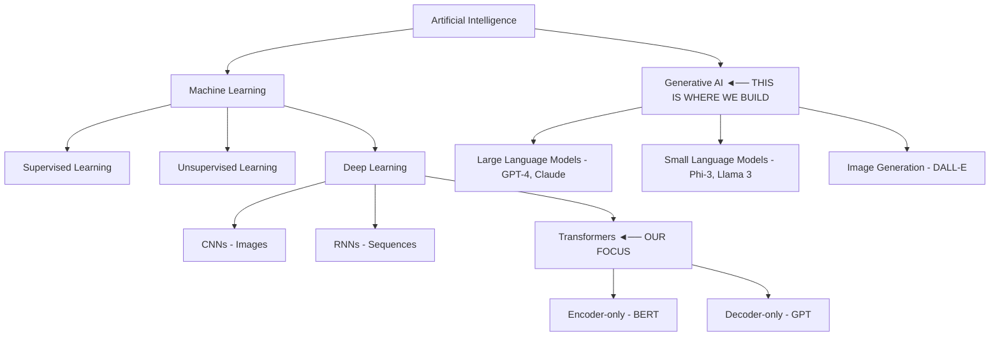
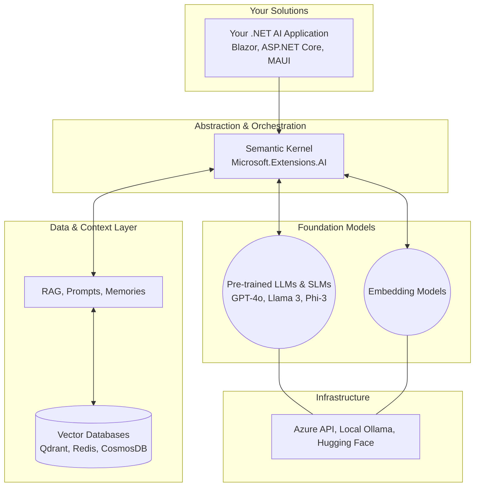

# AI Theory & Terminology

> **Type:** 📖 Theory | **Code:** None (pure theory, with conceptual C# examples)
>
> 🆕 *Updated with content from [Lesson 1: Introduction to Generative AI](https://github.com/microsoft/Generative-AI-for-beginners-dotnet/blob/main/01-IntroductionToGenerativeAI/readme.md) from Generative AI for Beginners .NET v2*

---

## 🎯 Learning Objectives

- Understand what Generative AI is and how it differs from traditional ML
- Know the difference between LLMs and SLMs
- Understand tokens, context windows, and temperature
- Map AI terminology to concepts you already know from .NET

---

## 📖 What is Artificial Intelligence?

**Definition:** Technology that allows computers to perform tasks that typically require human intelligence. Instead of rigidly following pre-programmed instructions, an AI system relies on vast amounts of data to emulate cognitive tasks.

**Examples of AI in Daily Life:**
1. **Pattern Recognition:** Algorithms identifying numeric sequences, predicting your next keystroke, or analyzing your streaming habits to recommend the perfect movie.
2. **Speech Recognition:** Voice assistants like Siri, Alexa, or the advanced ChatGPT Voice mode understanding natural language effortlessly.
3. **Image Analysis:** Automated traffic cameras reading blurred or fast-moving number plates, or smartphone cameras actively detecting faces.

### The AI Family Tree

AI is a vast overarching term. Here is where our focus area sits and how the subfields interact:



To dive deeply into these subfields, please review the dedicated detailed guides before proceeding:

1. **[Machine Learning (ML) Deep Dive](./Machine-Learning-Deep-Dive.md)** (Supervised, Unsupervised, Reinforcement Learning)
2. **[Deep Learning & Neural Networks](./Deep-Learning-and-Neural-Networks.md)** (FNN, RNN, CNN, Transformers)
3. **[Generative AI, NLP & Computer Vision](./Generative-AI-and-NLP.md)** (LLMs, RLHF, Vision Models)

---

## 🧠 Generative AI vs. Traditional ML

| Aspect | Traditional ML | Generative AI |
|--------|---------------|---------------|
| **Training data** | Labeled datasets for specific tasks | Massive unlabeled text from the internet |
| **Output** | Predictions (numbers, classes) | New content (text, images, code) |
| **Flexibility** | One model = one task | One model = many tasks via prompting |
| **Customization** | Retrain the model | Change the prompt |
| **.NET Analogy** | Like a typed `Func<Input, Output>` | Like a dynamic `Object` that can do anything |

### Real-World Example
- **Traditional ML:** Train a model on 10,000 support tickets to classify them as "Billing" or "Technical."
- **Generative AI:** Give GPT-5 a support ticket and ask: *"Classify this ticket and draft a response."* No training needed.

### 🆕 Key Insight from v2 Course

As the [Generative AI for Beginners .NET v2](https://github.com/microsoft/Generative-AI-for-beginners-dotnet) course puts it:

> *"If you've ever called a REST API, you already have the core skill needed to build AI-powered applications."*

```csharp
// This is ALL it takes in .NET 10:
var response = await chatClient.GetResponseAsync("Summarize this customer feedback");
Console.WriteLine(response);
```

Your existing .NET skills handle everything else: dependency injection, configuration, error handling, async patterns.

---

## 🔤 Large Language Models (LLMs) vs. Small Language Models (SLMs)

### LLMs — The Heavy Hitters
- **Examples:** GPT-5, GPT-5-mini, Claude 3.5 Sonnet, Gemini 2.0
- **Parameters:** 100B+ parameters
- **Hosting:** Cloud-only (too large for local machines)
- **Strengths:** Best reasoning, code generation, multi-step tasks
- **Cost:** $ per API call

### SLMs — The Efficient Alternatives
- **Examples:** Phi-4 Mini (Microsoft), Llama 3.1 8B (Meta), Mistral 7B
- **Parameters:** 1B-13B parameters
- **Hosting:** Can run locally on a good laptop/desktop
- **Strengths:** Fast, private, cheap; good for focused tasks
- **Cost:** Free (local inference with [Ollama](https://ollama.com))

### When to Use Which?

```
Decision Tree:
                    ┌─────────────────────┐
                    │ Do you need the      │
                    │ absolute best quality?│
                    └──────┬───────┬───────┘
                     Yes   │       │  No
                           ▼       ▼
                    ┌──────────┐  ┌──────────────────┐
                    │ Use LLM  │  │ Is data privacy   │
                    │ (GPT-4o) │  │ a concern?        │
                    └──────────┘  └──┬─────────┬─────┘
                                Yes │         │ No
                                    ▼         ▼
                             ┌──────────┐ ┌──────────┐
                             │ Use SLM  │ │ Use SLM  │
                             │ (Local)  │ │ via API  │
                             └──────────┘ │ (Cheaper)│
                                          └──────────┘
```

---

## 🔡 Tokens — The Currency of AI

### What is a Token?

A token is **not a character** and **not a word**. It's a sub-word unit that the model processes.

**Rules of thumb:**
- 1 token ≈ 4 characters in English
- 1 token ≈ ¾ of a word
- 100 tokens ≈ 75 words

### Tokenization Examples

```
Input: "Hello, world!"
Tokens: ["Hello", ",", " world", "!"]   → 4 tokens

Input: "C# is a great programming language"
Tokens: ["C", "#", " is", " a", " great", " programming", " language"]   → 7 tokens

Input: "Microsoft.Extensions.AI"
Tokens: ["Microsoft", ".", "Extensions", ".", "AI"]   → 5 tokens
```

### Why Tokens Matter for .NET Developers

```csharp
// You pay per token for API calls
// GPT-4o-mini pricing (as of 2024):
// Input:  $0.15 per 1M tokens
// Output: $0.60 per 1M tokens

// Example cost calculation:
var inputTokens = 500;   // Your prompt
var outputTokens = 200;  // Model's response
var costUsd = (inputTokens * 0.15 / 1_000_000) + (outputTokens * 0.60 / 1_000_000);
// Cost = $0.000195 — incredibly cheap!
```

### Token Counting in C#

```csharp
// Using Microsoft.ML.Tokenizers
using Microsoft.ML.Tokenizers;

var tokenizer = TiktokenTokenizer.CreateForModel("gpt-4o");
var tokens = tokenizer.CountTokens("Hello, how are you?");
Console.WriteLine($"Token count: {tokens}"); // Output: 6
```

---

## 📏 Context Window — The "Request Body Size Limit"

The context window is the **maximum number of tokens** the model can process in a single request (input + output combined).

| Model | Context Window | Approximate Pages |
|-------|---------------|-------------------|
| GPT-4o-mini | 128K tokens | ~200 pages |
| GPT-4o | 128K tokens | ~200 pages |
| Claude 3.5 Sonnet | 200K tokens | ~300 pages |
| Llama 3.1 8B | 128K tokens | ~200 pages |
| Phi-3 Mini | 4K-128K tokens | Varies |

### .NET Analogy
```csharp
// Think of it like a request size limit on your Web API:
builder.Services.Configure<KestrelServerOptions>(options =>
{
    options.Limits.MaxRequestBodySize = 128_000; // Like a 128K context window
});

// If your prompt + expected response exceeds this, the model will truncate!
```

### What Fills the Context Window?

```
[System Prompt]        ← Sets behavior (uses tokens!)
[Chat History]         ← Previous messages (grows over time!)
[Retrieved Context]    ← RAG content
[User's Current Query] ← The actual question
[Model's Response]     ← Generated output
─────────────────────
Total must be < Context Window size
```

> **⚠️ Key Insight:** As conversation history grows, you consume more and more of the context window. This is why **state management** is critical.

---

## 🌡️ Temperature — The "Randomness Dial"

Temperature controls how "creative" or "deterministic" the model's responses are.

| Temperature | Behavior | Use Case |
|-------------|----------|----------|
| 0.0 | Deterministic — always picks the most likely next token | Code generation, data extraction, classifications |
| 0.3 | Slightly creative but still focused | Customer support, summarization |
| 0.7 | Good balance of creativity and coherence | General conversation, brainstorming |
| 1.0 | Maximum creativity, may hallucinate | Creative writing, idea generation |

### .NET Analogy
```csharp
// Temperature = 0 is like:
var result = items.OrderByDescending(x => x.Probability).First();

// Temperature = 1 is like:
var result = items.OrderBy(_ => Random.Shared.Next()).First();

// Temperature = 0.7 is somewhere in between:
// Higher probability items are still favored, but there's randomness
```

---

## 🔑 Other Important Parameters

### Top-P (Nucleus Sampling)
- Controls the cumulative probability threshold
- `top_p = 0.9` means consider only tokens whose cumulative probability is within the top 90%
- Usually don't change both temperature AND top_p

### Max Tokens
- Limits the response length
- Important for cost control and preventing runaway responses

### Frequency Penalty & Presence Penalty
- `frequency_penalty`: Penalizes tokens that appear frequently (reduces repetition)
- `presence_penalty`: Penalizes tokens that have appeared at all (encourages new topics)

---

## 📊 The Transformer Architecture (Simplified)

You don't need to understand the math, but knowing the architecture helps:

```
Input Text
    │
    ▼
┌──────────────┐
│  Tokenizer   │  Splits text into tokens
└──────┬───────┘
       │
       ▼
┌──────────────┐
│  Embeddings  │  Converts tokens to vectors (Week 3)
└──────┬───────┘
       │
       ▼
┌──────────────────────────────┐
│  Transformer Layers (×N)     │
│  ┌────────────────────────┐  │
│  │  Self-Attention        │  │  "Which other tokens are relevant to this one?"
│  └────────────────────────┘  │
│  ┌────────────────────────┐  │
│  │  Feed-Forward Network  │  │  "What should the next token be?"
│  └────────────────────────┘  │
└──────────────┬───────────────┘
               │
               ▼
┌──────────────────────┐
│  Output Probabilities │  Ranked list of possible next tokens
└──────────────────────┘
```

### Key concept: **Self-Attention**
This is the breakthrough that made Transformers work. For each token, the model looks at ALL other tokens in the context to understand relationships.

Example: *"The **cat** sat on the mat because **it** was tired."*
- Self-attention helps the model understand that "it" refers to "cat", not "mat."

---

## 🗺️ The AI Application Stack in .NET

As an AI Engineer, you won't focus on training models. You'll **build applications on top of them:**



### 🆕 The .NET 10 AI Stack (v2 Layers)

The v2 course introduces a simpler, more practical layer model:

```
┌────────────────────────────────────────────────┐
│  Layer 3: Microsoft Agent Framework (MAF)  │
│  Build agents with tools and multi-agent   │
│  workflows. (Week 6-7)                     │
├────────────────────────────────────────────────┤
│  Layer 2: AI Models (The "Brains")          │
│  Azure OpenAI / Ollama / OpenAI             │
│  All work with the same IChatClient!        │
├────────────────────────────────────────────────┤
│  Layer 1: Microsoft.Extensions.AI (MEAI)    │
│  IChatClient + IEmbeddingGenerator          │
│  Caching, Telemetry, Retries (Week 1, 7)   │
└────────────────────────────────────────────────┘
```

> 📚 **Deep dive:** See [Week 7, Day 5: .NET 10 Migration Guide](../../../Week-07-Responsible-AI-and-Production/Day-05-DotNet10-Migration-Guide/README.md) for the complete migration path.

---

## 📝 Self-Assessment Quiz

1. What is the difference between an LLM and an SLM?
2. If your prompt contains 500 tokens and the model responds with 300 tokens, how many total tokens were used?
3. When should you set temperature to 0?
4. What happens when conversation history exceeds the context window?
5. Why is an AI Engineer different from an ML Engineer?

<details>
<summary>📋 Answers</summary>

1. **LLM** (100B+ params, cloud-hosted, best quality, costs money) vs **SLM** (1-13B params, can run locally, faster/cheaper, good for focused tasks).
2. **800 tokens** total (input + output).
3. When you need **deterministic, consistent results** — code generation, data extraction, classification.
4. The model **truncates** older messages or errors out. You need a strategy to manage history (summarization, sliding window).
5. **ML Engineers** train models from data. **AI Engineers** build applications USING pre-trained models via APIs.

</details>

---

## 📚 References & Further Reading

- [What are Large Language Models?](https://learn.microsoft.com/azure/ai-services/openai/concepts/models) — Microsoft Learn
- [GPT-4 Technical Report](https://arxiv.org/abs/2303.08774) — OpenAI
- [Attention Is All You Need](https://arxiv.org/abs/1706.03762) — The original Transformer paper
- [OpenAI Tokenizer](https://platform.openai.com/tokenizer) — Visualize tokens
- [AI for .NET Developers](https://learn.microsoft.com/dotnet/ai/) — Microsoft Learn

---

## ➡️ Next

Continue to **[Prompt Engineering Basics](../Day-02-Prompt-Engineering-Basics/README.md)**
