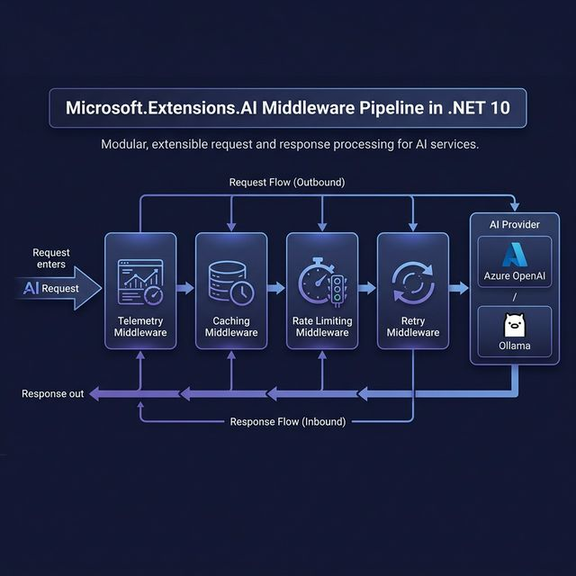

# Day 3: Structured Output & Middleware Pipelines

> **Type:** 💻 Code | **Time:** ~3 hours
> 
> 🆕 *Based on [Lesson 2 Part 2: Streaming & Structured Output](https://github.com/microsoft/Generative-AI-for-beginners-dotnet/blob/main/02-GenerativeAITechniques/02-streaming-structured-output.md) and [Part 4: Middleware Pipelines](https://github.com/microsoft/Generative-AI-for-beginners-dotnet/blob/main/02-GenerativeAITechniques/04-middleware-pipeline.md)*

---

## 🎯 Learning Objectives

- Get strongly-typed C# objects from AI responses (no more manual JSON parsing!)
- Build composable middleware pipelines with `ChatClientBuilder`
- Implement caching, telemetry, and retry middleware
- Create custom middleware for cross-cutting concerns

---

## 📖 Structured Output — Typed AI Responses

### The Problem

Without structured output, you're parsing free-form text:

```csharp
// ❌ The old way — fragile and error-prone
var response = await chatClient.GetResponseAsync("Analyze this review: 'Great product!'");
// Response: "The sentiment is positive with a score of 0.95..."
// Now you have to PARSE this text manually 😩
```

### The Solution — JSON Schema Output

```csharp
// ✅ The new way — strongly typed!
var response = await chatClient.GetResponseAsync<SentimentResult>(
    "Analyze this review: 'Great product!'");
// response.Result is a fully typed SentimentResult object! 🎉
```

### How It Works

```
Structured Output Pipeline:

┌──────────────┐     ┌──────────────────────┐     ┌──────────────┐
│   Your C#    │     │   Microsoft.Ext.AI   │     │   AI Model   │
│   Class      │────►│   Serializes your    │────►│   Receives   │
│              │     │   class as JSON       │     │   JSON       │
│ SentimentResult    │   schema in the       │     │   schema in  │
│ {             │     │   prompt             │     │   prompt     │
│   Sentiment   │     │                      │     │              │
│   Score       │     │                      │     │              │
│   Keywords[]  │     └──────────────────────┘     └──────┬───────┘
│ }             │                                         │
└──────────────┘     ┌──────────────────────┐            │
                     │   Deserializes JSON  │◄───────────┘
                     │   response into      │     AI returns
                     │   your C# class      │     valid JSON
                     └──────────────────────┘
```

---

## 💻 Code: Structured Output

### Defining Response Models

```csharp
using System.ComponentModel;
using System.Text.Json.Serialization;

/// <summary>
/// Define C# classes that represent the structure you want from the AI.
/// The [Description] attributes guide the model on what to generate.
/// </summary>

[Description("Analysis of customer review sentiment")]
public class SentimentResult
{
    [Description("The overall sentiment: Positive, Negative, or Neutral")]
    [JsonPropertyName("sentiment")]
    public string Sentiment { get; set; } = "";

    [Description("Confidence score from 0.0 to 1.0")]
    [JsonPropertyName("score")]
    public double Score { get; set; }

    [Description("Key phrases that influenced the sentiment")]
    [JsonPropertyName("keywords")]
    public List<string> Keywords { get; set; } = new();

    [Description("Brief explanation of the analysis")]
    [JsonPropertyName("explanation")]
    public string Explanation { get; set; } = "";
}

[Description("Extracted information from a product description")]
public class ProductInfo
{
    [JsonPropertyName("name")]
    public string Name { get; set; } = "";

    [JsonPropertyName("category")]
    public string Category { get; set; } = "";

    [JsonPropertyName("price")]
    public decimal Price { get; set; }

    [JsonPropertyName("features")]
    public List<string> Features { get; set; } = new();

    [JsonPropertyName("targetAudience")]
    public string TargetAudience { get; set; } = "";
}
```

### Using Structured Output

```csharp
using Microsoft.Extensions.AI;

// =====================================================
// Structured Output Demo — .NET 10
// Get strongly-typed C# objects from AI responses
// =====================================================

IChatClient chatClient = /* your configured client */;

// ── Example 1: Sentiment Analysis ──
Console.WriteLine("=== Structured Sentiment Analysis ===\n");

var sentimentResponse = await chatClient.GetResponseAsync<SentimentResult>(
    "Analyze the sentiment of this customer review: " +
    "'The laptop arrived quickly but the battery life is disappointing. " +
    "Screen quality is excellent though.'");

if (sentimentResponse.Result is { } sentiment)
{
    Console.WriteLine($"Sentiment: {sentiment.Sentiment}");
    Console.WriteLine($"Score: {sentiment.Score:F2}");
    Console.WriteLine($"Keywords: {string.Join(", ", sentiment.Keywords)}");
    Console.WriteLine($"Explanation: {sentiment.Explanation}");
}

// ── Example 2: Product Info Extraction ──
Console.WriteLine("\n=== Product Information Extraction ===\n");

var productResponse = await chatClient.GetResponseAsync<ProductInfo>(
    "Extract product details from: " +
    "'The XPS 15 by Dell is a premium ultrabook priced at $1,499. " +
    "Features include a 15.6\" OLED display, 32GB RAM, and 12-hour battery life. " +
    "Perfect for creative professionals and power users.'");

if (productResponse.Result is { } product)
{
    Console.WriteLine($"Name: {product.Name}");
    Console.WriteLine($"Category: {product.Category}");
    Console.WriteLine($"Price: ${product.Price:F2}");
    Console.WriteLine($"Features: {string.Join(", ", product.Features)}");
    Console.WriteLine($"Target: {product.TargetAudience}");
}
```

---

## 📖 Middleware Pipelines — The ASP.NET Core Pattern for AI



The `Microsoft.Extensions.AI` middleware pipeline works **exactly like ASP.NET Core middleware**. You compose behaviors by stacking middleware layers:


### Why Middleware?

| Without Middleware | With Middleware |
|---|---|
| Caching logic mixed in business code | Composable, reusable layers |
| Retry logic scattered everywhere | Add/remove behaviors without changing code |
| Telemetry manually in every call | Cross-cutting concerns handled automatically |
| Hard to test | Each layer testable independently |

---

## 💻 Code: Building Middleware Pipelines

### Using ChatClientBuilder

```csharp
using Microsoft.Extensions.AI;
using Microsoft.Extensions.Caching.Distributed;
using Microsoft.Extensions.Caching.Memory;
using Microsoft.Extensions.DependencyInjection;
using Microsoft.Extensions.Logging;
using OpenTelemetry.Trace;

// =====================================================
// Middleware Pipeline Demo — .NET 10
// Compose AI behaviors like ASP.NET Core middleware
// =====================================================

var services = new ServiceCollection();

// Configure logging
services.AddLogging(builder => builder.AddConsole());

// Configure distributed cache (in-memory for demo)
services.AddDistributedMemoryCache();

// Configure the AI client with middleware pipeline
services.AddChatClient(builder => builder
    // Layer 1: OpenTelemetry telemetry
    .UseOpenTelemetry(
        sourceName: "MyAIApp",
        configure: t => t.EnableSensitiveData = false)
    
    // Layer 2: Distributed caching (cache identical prompts)
    .UseDistributedCache()
    
    // Layer 3: Function calling invocation
    .UseFunctionInvocation()
    
    // Layer 4: The actual AI provider (innermost)
    .Use(new OpenAIClient(apiKey).AsChatClient("gpt-5-mini"))
);

var provider = services.BuildServiceProvider();
var chatClient = provider.GetRequiredService<IChatClient>();

// Now every call automatically gets telemetry + caching + function invocation!
var response = await chatClient.GetResponseAsync("What is .NET 10?");
Console.WriteLine(response.Text);

// This second identical call will be served from cache!
var cachedResponse = await chatClient.GetResponseAsync("What is .NET 10?");
Console.WriteLine($"(From cache) {cachedResponse.Text}");
```

### Custom Middleware

```csharp
using Microsoft.Extensions.AI;

/// <summary>
/// Custom middleware that logs token usage for cost tracking.
/// Follows the same pattern as ASP.NET Core middleware.
/// </summary>
public class TokenUsageMiddleware : DelegatingChatClient
{
    private readonly ILogger _logger;
    private long _totalInputTokens = 0;
    private long _totalOutputTokens = 0;

    public TokenUsageMiddleware(IChatClient innerClient, ILogger logger) 
        : base(innerClient)
    {
        _logger = logger;
    }

    public override async Task<ChatResponse> GetResponseAsync(
        IEnumerable<ChatMessage> messages,
        ChatOptions? options = null,
        CancellationToken cancellationToken = default)
    {
        var sw = System.Diagnostics.Stopwatch.StartNew();
        
        // Call the next middleware in the pipeline
        var response = await base.GetResponseAsync(messages, options, cancellationToken);
        
        sw.Stop();

        // Track usage
        var inputTokens = response.Usage?.InputTokenCount ?? 0;
        var outputTokens = response.Usage?.OutputTokenCount ?? 0;
        
        Interlocked.Add(ref _totalInputTokens, inputTokens);
        Interlocked.Add(ref _totalOutputTokens, outputTokens);

        _logger.LogInformation(
            "AI Call: Model={Model}, Input={Input}tok, Output={Output}tok, " +
            "Latency={Latency}ms, TotalCost=${Cost:F6}",
            response.ModelId,
            inputTokens, outputTokens,
            sw.ElapsedMilliseconds,
            CalculateCost(inputTokens, outputTokens));

        return response;
    }

    private static decimal CalculateCost(int input, int output)
    {
        // GPT-5-mini pricing (example)
        return (input * 0.15m / 1_000_000) + (output * 0.60m / 1_000_000);
    }

    public (long InputTokens, long OutputTokens) GetTotalUsage() 
        => (_totalInputTokens, _totalOutputTokens);
}

// ── Register custom middleware ──
// builder.Use((inner, sp) => 
//     new TokenUsageMiddleware(inner, sp.GetRequiredService<ILogger<TokenUsageMiddleware>>()));
```

### Rate Limiting Middleware

```csharp
using Microsoft.Extensions.AI;
using System.Threading.RateLimiting;

/// <summary>
/// Middleware that rate-limits AI API calls to prevent
/// excessive usage and cost overruns.
/// </summary>
public class RateLimitingMiddleware : DelegatingChatClient
{
    private readonly RateLimiter _limiter;

    public RateLimitingMiddleware(IChatClient innerClient, RateLimiter limiter) 
        : base(innerClient)
    {
        _limiter = limiter;
    }

    public override async Task<ChatResponse> GetResponseAsync(
        IEnumerable<ChatMessage> messages,
        ChatOptions? options = null,
        CancellationToken cancellationToken = default)
    {
        using var lease = await _limiter.AcquireAsync(1, cancellationToken);
        
        if (!lease.IsAcquired)
        {
            throw new InvalidOperationException(
                "Rate limit exceeded. Please retry after a short delay.");
        }

        return await base.GetResponseAsync(messages, options, cancellationToken);
    }
}

// ── Usage ──
// var limiter = new SlidingWindowRateLimiter(new SlidingWindowRateLimiterOptions
// {
//     PermitLimit = 60,              // 60 requests
//     Window = TimeSpan.FromMinutes(1), // per minute
//     SegmentsPerWindow = 6          // 6 sliding segments
// });
```

---

## 🏗️ Complete Pipeline Architecture

```
Production-Ready AI Pipeline in .NET 10:

                ┌──────────────────────────────────────────┐
                │         ChatClientBuilder Pipeline        │
                │                                          │
  Request ──►   │  ┌──────────────┐                       │
                │  │ Telemetry    │  OpenTelemetry traces  │
                │  └──────┬───────┘                       │
                │         ▼                                │
                │  ┌──────────────┐                       │
                │  │ Rate Limiter │  Prevent overuse       │
                │  └──────┬───────┘                       │
                │         ▼                                │
                │  ┌──────────────┐                       │
                │  │ Token Logger │  Cost tracking          │
                │  └──────┬───────┘                       │
                │         ▼                                │
                │  ┌──────────────┐                       │
                │  │ Cache        │  Skip duplicate calls  │
                │  └──────┬───────┘                       │
                │         ▼                                │
                │  ┌──────────────┐                       │
                │  │ Input Safety │  Injection defense     │
                │  └──────┬───────┘                       │
                │         ▼                                │
                │  ┌──────────────┐                       │
                │  │ Functions    │  Tool/function calling │
                │  └──────┬───────┘                       │
                │         ▼                                │
  Response ◄─── │  ┌──────────────┐                       │
                │  │ AI Provider  │  Azure/OpenAI/Ollama   │
                │  └──────────────┘                       │
                └──────────────────────────────────────────┘
```

---

## 📝 Self-Assessment Quiz

1. What's the advantage of structured output over parsing free-form text?
2. How is `ChatClientBuilder` similar to ASP.NET Core's middleware pipeline?
3. What does `DelegatingChatClient` do and why is it the base class for custom middleware?
4. Why should caching be placed between telemetry and the AI provider?
5. How would you implement a cost-tracking dashboard using middleware?

<details>
<summary>📋 Answers</summary>

1. **Structured output** returns strongly-typed C# objects directly, eliminating fragile text parsing, reducing errors, and enabling compile-time type checking.
2. Both use a **composable pipeline pattern** where each layer can inspect/modify the request and response, with layers executing in order for requests and reverse order for responses.
3. `DelegatingChatClient` is a base class that forwards calls to an inner client. Custom middleware overrides methods, adds logic, and calls `base.Method()` to continue the pipeline — exactly like `DelegatingHandler` in `HttpClient`.
4. Caching should be **after telemetry** (so telemetry records ALL calls including cache hits) but **before the AI provider** (so cached responses don't incur API costs).
5. Use a custom `DelegatingChatClient` middleware that records input/output token counts per call, multiplies by pricing, and stores in a database or emits metrics to a monitoring dashboard.

</details>

---

## 📚 References

- [Request Structured Output](https://learn.microsoft.com/dotnet/ai/quickstarts/structured-output)
- [Microsoft.Extensions.AI Middleware](https://learn.microsoft.com/dotnet/ai/ai-extensions)
- [IChatClient Interface Guide](https://learn.microsoft.com/dotnet/ai/ichatclient)
- [Build an AI Chat App with .NET](https://learn.microsoft.com/dotnet/ai/quickstarts/build-chat-app)
- [OpenTelemetry for .NET](https://learn.microsoft.com/dotnet/core/diagnostics/observability-with-otel)

---

## ➡️ Next

Continue to **[Day 4: Local Models & Deployment](../Day-04-Local-Models-and-Deployment/README.md)**
