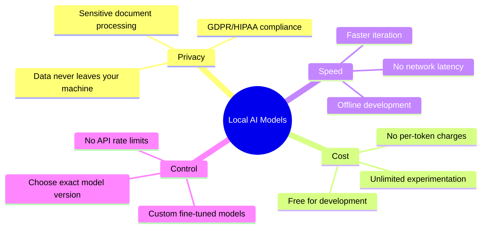
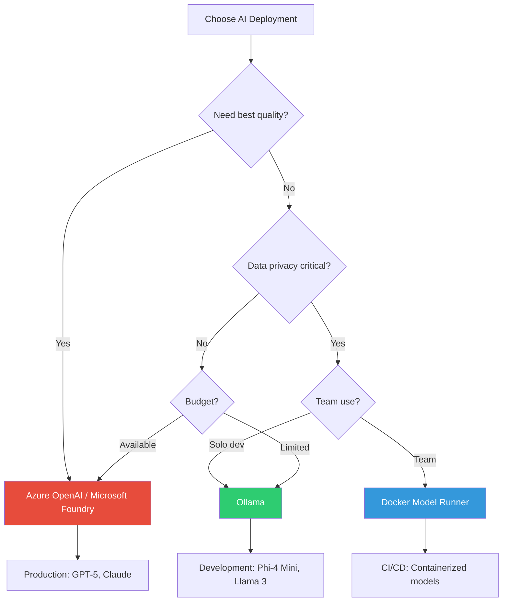

# Day 4: Local Models & Deployment Options

> **Type:** 💻 Code | **Time:** ~3 hours
> 
> 🆕 *Based on [Lesson 3 Part 5: Local Model Runners](https://github.com/microsoft/Generative-AI-for-beginners-dotnet/blob/main/03-AIPatternsAndApplications/05-LocalModelRunners.md) from Generative AI for Beginners .NET v2*

---

## 🎯 Learning Objectives

- Run AI models locally for privacy, cost savings, and offline development
- Set up and use Ollama with .NET 10
- Understand Docker Model Runner for containerized AI
- Learn about AI Toolkit and Foundry Local
- Choose the right deployment option for your scenario

---

## 📖 Why Run Models Locally?



| Factor | Cloud (Azure OpenAI) | Local (Ollama) |
|--------|---------------------|----------------|
| **Quality** | ⭐⭐⭐⭐⭐ (GPT-5, Claude) | ⭐⭐⭐ (Phi-4, Llama 3) |
| **Privacy** | Data sent to cloud | Data stays local |
| **Cost** | Pay per token | Free |
| **Setup** | API key + endpoint | Install + download model |
| **Offline** | ❌ Requires internet | ✅ Works offline |
| **Speed** | Network + inference | Just inference |
| **Scalability** | ∞ (cloud scales) | Limited by hardware |
| **Best For** | Production, best quality | Development, privacy, testing |

---

## 🐳 Option 1: Ollama — Easiest Local Setup

[Ollama](https://ollama.com) is the simplest way to run LLMs locally on your machine.

### Setup

```powershell
# 1. Install Ollama (Windows)
winget install Ollama.Ollama

# 2. Pull a model (phi4-mini is fast and good for .NET)
ollama pull phi4-mini

# 3. Verify it works
ollama run phi4-mini "Hello, are you working?"
```

### Recommended Models for .NET Development

| Model | Size | Strengths | Best For |
|-------|------|-----------|----------|
| `phi4-mini` | 3.8B | Fast, great for code | Development, testing |
| `llama3.1:8b` | 8B | Good general purpose | Balanced quality/speed |
| `codellama:13b` | 13B | Strong at code generation | Code-focused tasks |
| `mistral:7b` | 7B | Good reasoning | General AI features |
| `nomic-embed-text` | 137M | Text embeddings | RAG ingestion pipelines |

### .NET 10 Integration with Ollama

```csharp
using Microsoft.Extensions.AI;

// =====================================================
// Local AI with Ollama — .NET 10
// Same IChatClient interface, runs entirely on your machine!
// =====================================================

// Option A: Direct instantiation
IChatClient chatClient = new OllamaChatClient(
    new Uri("http://localhost:11434"), 
    "phi4-mini");

// Option B: With DI (recommended for production)
var builder = WebApplication.CreateBuilder(args);
builder.Services.AddChatClient(b => b
    .UseOpenTelemetry()
    .UseDistributedCache()
    .Use(new OllamaChatClient(
        new Uri("http://localhost:11434"), 
        "phi4-mini")));

// ── Usage (identical to cloud!) ──
var response = await chatClient.GetResponseAsync(
    "Write a C# record class for a User with Name and Email");

Console.WriteLine(response.Text);

// ── Embeddings with Ollama ──
IEmbeddingGenerator<string, Embedding<float>> embedder = 
    new OllamaEmbeddingGenerator(
        new Uri("http://localhost:11434"), 
        "nomic-embed-text");

var embeddings = await embedder.GenerateAsync(new[] { "Hello world" });
Console.WriteLine($"Embedding dimensions: {embeddings[0].Vector.Length}");
```

### The Power of Same Interface

```csharp
// =====================================================
// The IChatClient magic: Switch with configuration!
// =====================================================

// appsettings.json
// {
//   "AI": {
//     "Provider": "Ollama",  // or "AzureOpenAI" or "OpenAI"
//     "Ollama": {
//       "Endpoint": "http://localhost:11434",
//       "Model": "phi4-mini"
//     },
//     "AzureOpenAI": {
//       "Endpoint": "https://myapp.openai.azure.com/",
//       "Deployment": "gpt-5-mini"
//     }
//   }
// }

public static IChatClient CreateChatClient(IConfiguration config)
{
    var provider = config["AI:Provider"];

    return provider switch
    {
        "Ollama" => new OllamaChatClient(
            new Uri(config["AI:Ollama:Endpoint"]!),
            config["AI:Ollama:Model"]!),

        "AzureOpenAI" => new AzureOpenAIClient(
            new Uri(config["AI:AzureOpenAI:Endpoint"]!),
            new Azure.Identity.AzureCliCredential())
            .AsChatClient(config["AI:AzureOpenAI:Deployment"]!),

        "OpenAI" => new OpenAIClient(config["AI:OpenAI:ApiKey"]!)
            .AsChatClient(config["AI:OpenAI:Model"]!),

        _ => throw new InvalidOperationException($"Unknown AI provider: {provider}")
    };
}
```

---

## 🐋 Option 2: Docker Model Runner

Run AI models as Docker containers — perfect for teams and CI/CD.

```powershell
# Pull and run a model as a Docker container
docker model pull phi4-mini
docker model run phi4-mini

# The model exposes an OpenAI-compatible API at localhost
```

### .NET Integration

```csharp
// Docker Model Runner exposes an OpenAI-compatible endpoint
IChatClient chatClient = new OpenAIChatClient(
    new OpenAIClientOptions
    {
        Endpoint = new Uri("http://localhost:12434/v1"),
    },
    "phi4-mini",
    apiKey: "not-needed" // Local, no auth required
);

var response = await chatClient.GetResponseAsync("Hello from Docker!");
```

---

## 🛠️ Option 3: AI Toolkit (Visual Studio)

AI Toolkit provides a GUI for managing and testing local models directly in VS Code or Visual Studio.

### Features

- 🔍 **Model Catalog** — Browse and download models from Hugging Face
- ▶️ **One-Click Run** — Start models without CLI commands
- 💬 **Built-in Playground** — Test prompts before coding
- 📊 **Performance Monitoring** — Track inference speed and memory

### Setup

```powershell
# Install VS Code extension
code --install-extension ms-windows-ai-studio.windows-ai-studio
```

---

## 🏢 Option 4: Foundry Local

Microsoft Foundry Local provides local model hosting with the same API as Azure OpenAI / Microsoft Foundry.

```csharp
// Foundry Local looks exactly like Azure OpenAI to your code
IChatClient chatClient = new AzureOpenAIChatClient(
    new Uri("http://localhost:5272"), // Foundry Local endpoint
    new ApiKeyCredential("local"),
    "phi4-mini");
```

---

## 📊 Choosing Your Deployment Option



| Scenario | Recommended Option | Why |
|----------|-------------------|-----|
| **Learning & prototyping** | Ollama | Free, simple, fast setup |
| **Production web app** | Azure OpenAI | Best quality, SLA, scalable |
| **Privacy-sensitive data** | Ollama or Docker Model Runner | Data stays local |
| **Team development** | Docker Model Runner | Consistent across team |
| **CI/CD testing** | Docker Model Runner | Containerized, reproducible |
| **VS Code development** | AI Toolkit | GUI, playground, easy |
| **Hybrid (dev/prod)** | Ollama (dev) + Azure (prod) | Best of both worlds |

---

## 💻 Code: Hybrid Provider with Health Checks

```csharp
using Microsoft.Extensions.AI;
using Microsoft.Extensions.Diagnostics.HealthChecks;

/// <summary>
/// Automatically falls back from cloud to local when cloud is unavailable.
/// Uses the same IChatClient interface for seamless switching.
/// </summary>
public class HybridChatClient : IChatClient
{
    private readonly IChatClient _primary;    // Cloud
    private readonly IChatClient _fallback;   // Local
    private readonly ILogger<HybridChatClient> _logger;

    public HybridChatClient(
        IChatClient primary,
        IChatClient fallback,
        ILogger<HybridChatClient> logger)
    {
        _primary = primary;
        _fallback = fallback;
        _logger = logger;
    }

    public ChatClientMetadata Metadata => _primary.Metadata;

    public async Task<ChatResponse> GetResponseAsync(
        IEnumerable<ChatMessage> messages,
        ChatOptions? options = null,
        CancellationToken cancellationToken = default)
    {
        try
        {
            return await _primary.GetResponseAsync(messages, options, cancellationToken);
        }
        catch (Exception ex)
        {
            _logger.LogWarning(ex, 
                "Primary AI provider failed. Falling back to local model.");
            return await _fallback.GetResponseAsync(messages, options, cancellationToken);
        }
    }

    public IAsyncEnumerable<ChatResponseUpdate> GetStreamingResponseAsync(
        IEnumerable<ChatMessage> messages,
        ChatOptions? options = null,
        CancellationToken cancellationToken = default)
    {
        // Simplified — in production, wrap with try/catch and fallback
        return _primary.GetStreamingResponseAsync(messages, options, cancellationToken);
    }

    public void Dispose()
    {
        _primary.Dispose();
        _fallback.Dispose();
    }
}
```

---

## 📝 Self-Assessment Quiz

1. When should you use Ollama vs Azure OpenAI?
2. What's the key benefit of the `IChatClient` abstraction for local/cloud switching?
3. How does Docker Model Runner differ from Ollama?
4. What model would you choose for a privacy-sensitive document processing pipeline?
5. Describe a hybrid deployment strategy for development vs production.

<details>
<summary>📋 Answers</summary>

1. **Ollama** for development, learning, privacy-sensitive work, and cost savings. **Azure OpenAI** for production where you need the best quality, reliability, and SLA.
2. The `IChatClient` abstraction means your application code is **100% provider-agnostic**. You can switch from cloud to local by changing a single line of configuration — no business logic changes needed.
3. **Docker Model Runner** runs models as containers (great for teams, CI/CD, reproducibility). **Ollama** runs models as a system service (simpler for solo development). Both expose compatible APIs.
4. A **local model like Phi-4 Mini** running via Ollama or Docker Model Runner, so sensitive data never leaves the local machine.
5. Use **Ollama locally** during development (free, fast iteration) with **Azure OpenAI in production** (best quality, SLA). The `IChatClient` interface means the same code works with both — just change the configuration per environment.

</details>

---

## 📚 References

- [Ollama Documentation](https://ollama.com)
- [Docker Model Runner](https://docs.docker.com/desktop/features/model-runner/)
- [AI Toolkit for VS Code](https://marketplace.visualstudio.com/items?itemName=ms-windows-ai-studio.windows-ai-studio)
- [Foundry Local](https://learn.microsoft.com/foundry/foundry-local/overview)
- [Run .NET AI with Local Models](https://learn.microsoft.com/dotnet/ai/quickstarts/local-ai)

---

## ➡️ Next

Continue to **[Day 5: .NET 10 Migration Guide](../Day-05-DotNet10-Migration-Guide/README.md)**
