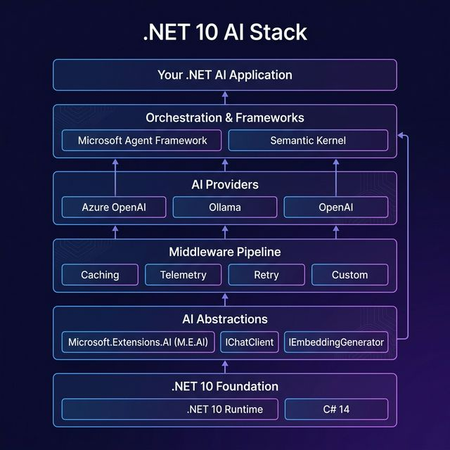
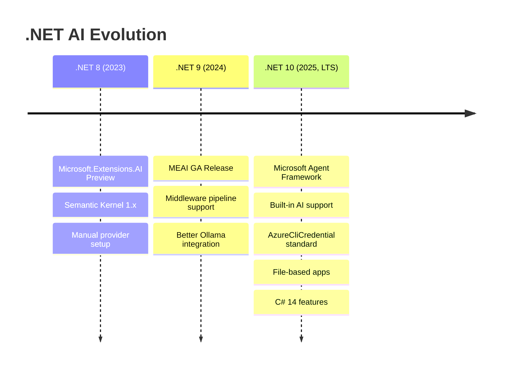
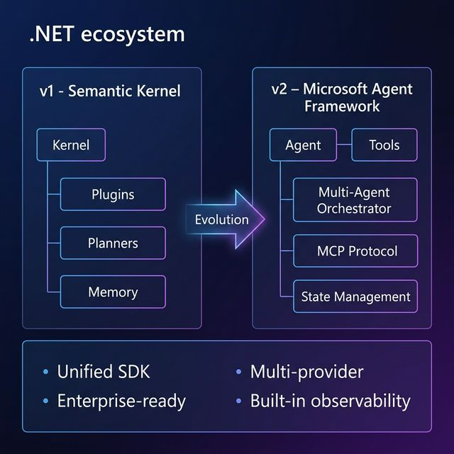
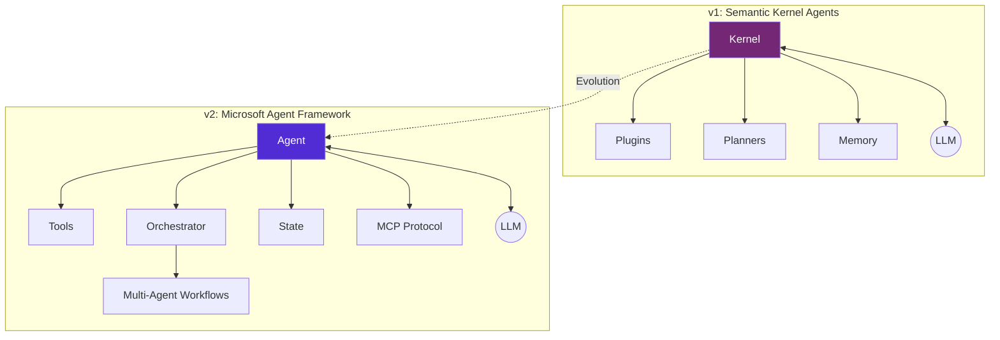

# Day 5: .NET 10 Migration Guide

> **Type:** 💻 Code | **Time:** ~3 hours
> 
> 🆕 *Comprehensive guide based on [Generative AI for Beginners .NET v2](https://github.com/microsoft/Generative-AI-for-beginners-dotnet) updated patterns for .NET 10*

---

## 🎯 Learning Objectives

- Understand what's new in .NET 10 for AI development
- Migrate existing .NET 8 AI code to .NET 10 patterns
- Use `AzureCliCredential` for standardized authentication
- Adopt modern file-based application patterns
- Leverage the Microsoft Agent Framework (MAF)

---

## 📖 .NET 10 — The AI-Native Runtime

.NET 10 is the first version of .NET where AI is a **first-class, built-in concern**. Here's what changed:





### Key Changes for AI Developers

| Feature | .NET 8 | .NET 10 |
|---------|--------|---------|
| **AI Abstraction** | `Microsoft.Extensions.AI` (preview) | `Microsoft.Extensions.AI` (GA, built-in) |
| **Agent Framework** | Semantic Kernel Planners | Microsoft Agent Framework (MAF) |
| **Authentication** | API keys in config | `AzureCliCredential` (standardized) |
| **App Pattern** | `Program.cs` + `Startup.cs` | File-based apps (`app.cs`) |
| **Caching** | Manual implementation | Built-in `UseDistributedCache()` middleware |
| **Telemetry** | Manual OpenTelemetry setup | Built-in `UseOpenTelemetry()` middleware |
| **Runtime** | .NET 8 (LTS) | .NET 10 (LTS) |
| **Language** | C# 12 | C# 14 |

---

## 🔄 Migration Steps

### Step 1: Update the Target Framework

```xml
<!-- OLD: your.csproj -->
<Project Sdk="Microsoft.NET.Sdk">
  <PropertyGroup>
    <TargetFramework>net8.0</TargetFramework>
  </PropertyGroup>
</Project>

<!-- NEW: your.csproj -->
<Project Sdk="Microsoft.NET.Sdk">
  <PropertyGroup>
    <TargetFramework>net10.0</TargetFramework>
  </PropertyGroup>
</Project>
```

```powershell
# Update global.json
dotnet new globaljson --sdk-version 10.0.100 --force

# Update all packages
dotnet add package Microsoft.Extensions.AI
dotnet add package Microsoft.Extensions.AI.OpenAI
```

### Step 2: Standardize Authentication

```csharp
// ❌ OLD: API key in code or secrets
var client = new AzureOpenAIClient(
    new Uri(endpoint),
    new AzureKeyCredential(apiKey));

// ✅ NEW: AzureCliCredential (no keys in code!)
using Azure.Identity;

var client = new AzureOpenAIClient(
    new Uri(endpoint),
    new AzureCliCredential());

// Prerequisite: Run "az login" once in your terminal
// AzureCliCredential automatically uses your Azure CLI session
```

### Step 3: Use Modern API Methods

```csharp
// ❌ OLD (.NET 8): CompleteAsync with ChatMessage list
var messages = new List<ChatMessage>
{
    new(ChatRole.System, "You are helpful."),
    new(ChatRole.User, "Hello!")
};
var response = await chatClient.CompleteAsync(messages);
Console.WriteLine(response.Message.Text);

// ✅ NEW (.NET 10): GetResponseAsync (cleaner API)
var response = await chatClient.GetResponseAsync("Hello!");
Console.WriteLine(response.Text);

// ✅ NEW: With messages (still supported)
var messages = new List<ChatMessage>
{
    new(ChatRole.System, "You are helpful."),
    new(ChatRole.User, "Hello!")
};
var response = await chatClient.GetResponseAsync(messages);
Console.WriteLine(response.Text);
```

### Step 4: Adopt Middleware Pipelines

```csharp
// ❌ OLD: Manual boilerplate for caching, telemetry, retry
IChatClient chatClient = new OpenAIClient(apiKey).AsChatClient("gpt-4o-mini");
// Then manually add try-catch, caching, logging around every call...

// ✅ NEW: ChatClientBuilder pipeline (like ASP.NET Core middleware)
var builder = WebApplication.CreateBuilder(args);

builder.Services.AddDistributedMemoryCache();
builder.Services.AddChatClient(pipeline => pipeline
    .UseOpenTelemetry()           // Automatic traces
    .UseDistributedCache()        // Automatic caching
    .UseFunctionInvocation()      // Auto function calling
    .Use(new AzureOpenAIClient(
        new Uri(endpoint), 
        new AzureCliCredential())
        .AsChatClient("gpt-5-mini")));
```

### Step 5: Structured Output (New in v2)

```csharp
using System.ComponentModel;
using Microsoft.Extensions.AI;

// ❌ OLD: Parse free-form text responses manually
var response = await chatClient.GetResponseAsync("Extract the name and email...");
// Then regex or string.Split to get data out 😩

// ✅ NEW: Strongly typed responses!
[Description("Contact information")]
public record ContactInfo(
    [property: Description("Full name")] string Name,
    [property: Description("Email address")] string Email,
    [property: Description("Phone number")] string? Phone
);

var response = await chatClient.GetResponseAsync<ContactInfo>(
    "Extract contact info from: 'Call John at john@example.com or 555-0123'");

Console.WriteLine(response.Result?.Name);   // "John"
Console.WriteLine(response.Result?.Email);  // "john@example.com"
Console.WriteLine(response.Result?.Phone);  // "555-0123"
```

---

## 🤖 Microsoft Agent Framework (MAF) — Replacing SK Planners



The **Microsoft Agent Framework** (MAF) is the new way to build AI agents in .NET 10, superseding Semantic Kernel's Planners.



### From SK Planners to MAF Agents

```csharp
// ❌ OLD: Semantic Kernel Agent
using Microsoft.SemanticKernel;

var kernel = Kernel.CreateBuilder()
    .AddAzureOpenAIChatCompletion("gpt-4o", endpoint, apiKey)
    .Build();

kernel.ImportPluginFromType<MyPlugin>();

var result = await kernel.InvokePromptAsync(
    "Calculate tax for $100 in California",
    new KernelArguments
    {
        { "auto_invoke", true }
    });

// ✅ NEW: Microsoft Agent Framework Agent
using Microsoft.Agents.AI;
using Microsoft.Agents.AI.ChatCompletion;
using Microsoft.Extensions.AI;

var chatClient = new AzureOpenAIClient(
    new Uri(endpoint), new AzureCliCredential())
    .AsChatClient("gpt-5-mini");

var agent = new ChatClientAgent(
    chatClient,
    name: "TaxCalculator",
    instructions: "You are a tax calculation assistant.");

// Register tools (functions the agent can call)
agent.AddTool(AIFunctionFactory.Create(
    (decimal amount, string state) =>
    {
        var taxRates = new Dictionary<string, decimal>
        {
            ["California"] = 0.0725m,
            ["Texas"] = 0.0625m,
            ["New York"] = 0.08m,
        };
        var rate = taxRates.GetValueOrDefault(state, 0.05m);
        return amount * rate;
    },
    name: "CalculateTax",
    description: "Calculate sales tax for a given amount and state"));

// Run the agent
var response = await agent.RunAsync(
    "Calculate the tax for a $100 purchase in California");
Console.WriteLine(response.Text);
```

### Multi-Agent Workflows

```csharp
// =====================================================
// MAF Multi-Agent Workflow — .NET 10
// Multiple specialized agents collaborating
// =====================================================

var researchAgent = new ChatClientAgent(chatClient,
    name: "Researcher",
    instructions: "You research topics thoroughly and provide facts.");

var writerAgent = new ChatClientAgent(chatClient,
    name: "Writer",
    instructions: "You take research and create clear, engaging summaries.");

var editorAgent = new ChatClientAgent(chatClient,
    name: "Editor",
    instructions: "You review content for accuracy, grammar, and clarity.");

// Sequential pipeline: Research → Write → Edit
var pipeline = new AgentPipeline(new[] { researchAgent, writerAgent, editorAgent });

var finalResult = await pipeline.RunAsync(
    "Create a brief report on the state of .NET AI development in 2026");

Console.WriteLine(finalResult.Text);
```

### Model Context Protocol (MCP) Integration

```csharp
// =====================================================
// MCP = Standardized way for agents to use external tools
// Think of it as USB for AI tools
// =====================================================

using Microsoft.Agents.AI;

var agent = new ChatClientAgent(chatClient,
    name: "Assistant",
    instructions: "You are a helpful assistant with access to tools.");

// Connect to an MCP server (provides tools like file access, databases, APIs)
agent.AddMcpServer(new McpServerConfig
{
    Name = "filesystem",
    Transport = "stdio",
    Command = "mcp-fs-server",
    Args = new[] { "/allowed/path" }
});

// The agent can now use file system tools provided by the MCP server
var response = await agent.RunAsync(
    "List all .cs files in the project and summarize what each does");
```

---

## 📊 Migration Checklist

| # | Task | Status |
|---|------|--------|
| 1 | Update `TargetFramework` to `net10.0` | ⬜ |
| 2 | Update all NuGet packages to .NET 10 versions | ⬜ |
| 3 | Replace API key auth with `AzureCliCredential` | ⬜ |
| 4 | Update `CompleteAsync` → `GetResponseAsync` | ⬜ |
| 5 | Add middleware pipeline (`ChatClientBuilder`) | ⬜ |
| 6 | Adopt structured output for data extraction | ⬜ |
| 7 | Migrate SK Planners → MAF Agents | ⬜ |
| 8 | Add content safety guards | ⬜ |
| 9 | Test with local models (Ollama) | ⬜ |
| 10 | Update CI/CD pipeline for .NET 10 | ⬜ |

---

## 🔑 Key C# 14 Features for AI Code

```csharp
// ── Primary Constructors (C# 12+, still relevant) ──
public class AIService(IChatClient chatClient, ILogger<AIService> logger)
{
    public async Task<string> AskAsync(string question)
    {
        logger.LogInformation("Processing: {Question}", question);
        var response = await chatClient.GetResponseAsync(question);
        return response.Text ?? "";
    }
}

// ── Collection Expressions ──
List<ChatMessage> messages = 
[
    new(ChatRole.System, "You are helpful."),
    new(ChatRole.User, "Hello!"),
];

// ── Pattern Matching Enhancements ──
var riskLevel = action switch
{
    { Type: "read" } => "low",
    { Type: "write", RequiresAuth: true } => "medium",
    { Type: "delete" } or { Type: "financial" } => "high",
    _ => "unknown"
};
```

---

## 📝 Self-Assessment Quiz

1. What is the primary authentication method in the v2 course?
2. Name 3 middleware layers you can add with `ChatClientBuilder`.
3. How does MAF differ from Semantic Kernel for building agents?
4. What's the benefit of structured output over manual text parsing?
5. Why is .NET 10 called the "AI-native" runtime?

<details>
<summary>📋 Answers</summary>

1. **`AzureCliCredential`** — uses your Azure CLI login session, no API keys needed in code.
2. `UseOpenTelemetry()`, `UseDistributedCache()`, `UseFunctionInvocation()`, plus custom `DelegatingChatClient` middleware.
3. **MAF** provides a unified, dedicated framework for agents with built-in multi-agent orchestration, MCP protocol support, typed tools, and enterprise features. **SK** used Planners as an add-on to the Kernel, with less native agent support.
4. **Structured output** returns C# objects directly, enabling compile-time type checking, IntelliSense, and eliminating fragile text parsing code.
5. .NET 10 ships with `Microsoft.Extensions.AI` GA, the Microsoft Agent Framework, built-in AI middleware, `AzureCliCredential` standard auth, and first-class support for building AI applications — AI is no longer an afterthought but a core platform capability.

</details>

---

## 📚 References

- [.NET 10 What's New](https://learn.microsoft.com/dotnet/core/whats-new/dotnet-10)
- [Microsoft Agent Framework](https://github.com/microsoft/agent-framework)
- [Agent Framework Overview](https://learn.microsoft.com/agent-framework/overview/agent-framework-overview)
- [Microsoft.Extensions.AI](https://learn.microsoft.com/dotnet/ai/ai-extensions)
- [AzureCliCredential](https://learn.microsoft.com/dotnet/api/azure.identity.azureclicredential)
- [Model Context Protocol](https://modelcontextprotocol.io/)
- [Generative AI for Beginners .NET v2](https://github.com/microsoft/Generative-AI-for-beginners-dotnet)

---

## 🎉 Week 7 Complete!

You've now covered:
- ✅ Responsible AI principles and bias mitigation
- ✅ Content safety, guardrails, and prompt injection defense
- ✅ Structured output and middleware pipelines
- ✅ Local model deployment options
- ✅ .NET 10 migration and modern patterns

Continue to the **[Capstone Project](../../Capstone-Project/README.md)** to put everything together!
