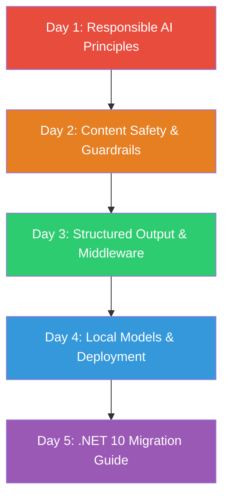

# Week 7: Responsible AI & Production Patterns

> **New!** 🆕 Based on [Generative AI for Beginners .NET v2](https://github.com/microsoft/Generative-AI-for-beginners-dotnet) — Updated for **.NET 10**

---

## 🎯 Overview

This week covers the essential topics for **shipping AI features responsibly and at production quality**. Based on Microsoft's updated curriculum (v2, March 2026), this module bridges the gap between "it works on my machine" and "it's ready for production."

You'll learn structured output, middleware pipelines, content safety, responsible AI practices, local model deployment, and how to migrate everything to .NET 10.

---

## 🗺️ Week Architecture

---

## 📅 Daily Breakdown

| Day | Topic | Type | Key Skills |
|-----|-------|------|------------|
| 1 | [Responsible AI Principles](./Day-01-Responsible-AI-Principles/README.md) | 📖 Theory | Bias identification, Microsoft's 6 principles, ethical AI |
| 2 | [Content Safety & Guardrails](./Day-02-Content-Safety-and-Guardrails/README.md) | 💻 Code | Azure Content Safety, input/output filtering, HITL for agents |
| 3 | [Structured Output & Middleware](./Day-03-Structured-Output-and-Middleware/README.md) | 💻 Code | `ChatClientBuilder`, caching, telemetry, JSON schema output |
| 4 | [Local Models & Deployment](./Day-04-Local-Models-and-Deployment/README.md) | 💻 Code | Ollama, AI Toolkit, Docker Model Runner, Foundry Local |
| 5 | [.NET 10 Migration Guide](./Day-05-DotNet10-Migration-Guide/README.md) | 💻 Code | .NET 10 upgrade, `AzureCliCredential`, modern patterns |

---

## 🆕 What's New from Generative AI for Beginners v2

This week incorporates key material from Microsoft's completely rewritten curriculum:

| v1 (Our Original) | v2 (New Material) |
|---|---|
| Semantic Kernel as primary tool | `Microsoft.Extensions.AI` as primary abstraction |
| SK Planners for agents | Microsoft Agent Framework (MAF) |
| Basic API connections | Middleware pipelines with caching & telemetry |
| .NET 8 | .NET 10 with modern patterns |
| No responsible AI coverage | Comprehensive responsible AI module |
| No structured output | Strongly-typed AI responses |
| No local model runners | Ollama, AI Toolkit, Docker Model Runner |

---

## 📦 Prerequisites

Before starting this week, you should have completed:
- ✅ Weeks 1-6 (AI Fundamentals through Autonomous Agents)
- ✅ A working Azure OpenAI deployment OR local Ollama setup
- ✅ .NET 10 SDK installed

---

## 📚 References

- [Generative AI for Beginners .NET v2](https://github.com/microsoft/Generative-AI-for-beginners-dotnet) — Microsoft's official course
- [Microsoft Responsible AI](https://www.microsoft.com/ai/responsible-ai) — Principles & framework
- [Microsoft.Extensions.AI Docs](https://learn.microsoft.com/dotnet/ai/ai-extensions) — Unified AI abstraction
- [Microsoft Agent Framework](https://github.com/microsoft/agent-framework) — Multi-agent SDK
- [.NET 10 What's New](https://learn.microsoft.com/dotnet/core/whats-new/dotnet-10) — Release highlights
