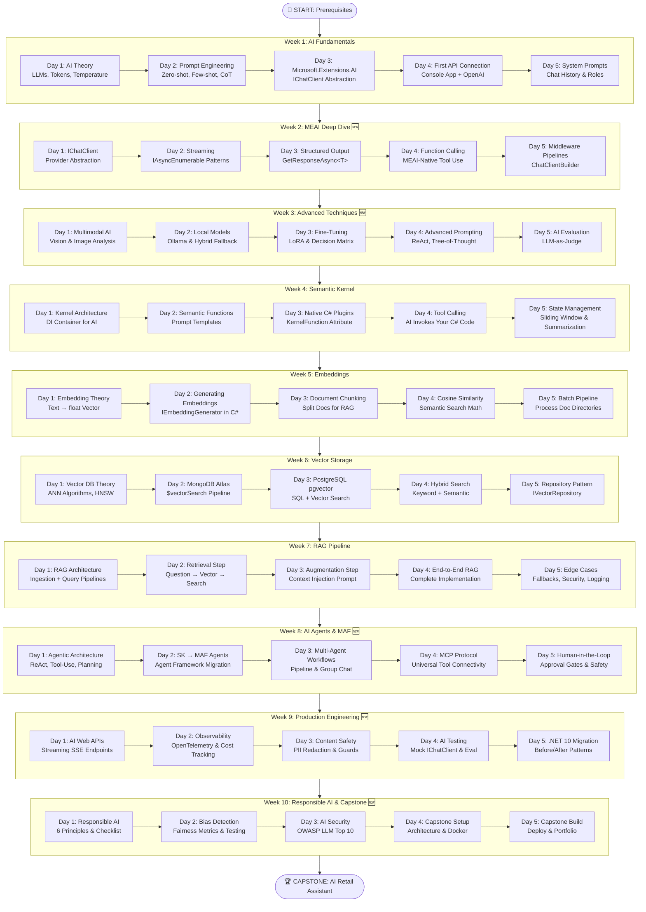

# 🗺️ Dotnet AI Engineer — Visual Roadmap

> **A strategic overview of the 10-week journey to mastering AI engineering within the .NET 10 ecosystem.**
>
> 🆕 *v3.0 — Expanded to 10 Weeks (50 Days) — Includes MEAI Deep Dive, Multimodal AI, MCP, AI Testing, Production Engineering, and MAF*

---

## The Complete Journey



---

## Technology Stack Map

```
┌──────────────────────────────────────────────────────────────────┐
│                    YOUR .NET AI APPLICATION                       │
│                                                                   │
│  ┌─────────────────────────────────────────────────────────────┐ │
│  │              🆕 WEEK 10: RESPONSIBLE AI & CAPSTONE          │ │
│  │  6 Principles, Bias Detection, OWASP LLM Top 10, Capstone  │ │
│  ├─────────────────────────────────────────────────────────────┤ │
│  │              🆕 WEEK 9: PRODUCTION ENGINEERING              │ │
│  │  ASP.NET APIs, OpenTelemetry, Content Safety, AI Testing    │ │
│  ├─────────────────────────────────────────────────────────────┤ │
│  │              🆕 WEEK 8: AI AGENTS & MAF                     │ │
│  │  Agentic Patterns, MAF, Multi-Agent, MCP, Human-in-Loop    │ │
│  ├─────────────────────────────────────────────────────────────┤ │
│  │                    WEEK 7: RAG PIPELINE                      │ │
│  │  Retrieval → Augmentation → Generation → Validation          │ │
│  ├─────────────────────────────────────────────────────────────┤ │
│  │         WEEK 6: VECTOR STORAGE          │  WEEK 5: EMBEDDINGS│ │
│  │  MongoDB Atlas, pgvector, Hybrid Search │  Chunk, Embed,     │ │
│  │  Repository Pattern                     │  Cosine Similarity  │ │
│  ├─────────────────────────────────────────────────────────────┤ │
│  │                    WEEK 4: SEMANTIC KERNEL                   │ │
│  │  Kernel, Plugins, Semantic Functions, Tool Calling           │ │
│  ├─────────────────────────────────────────────────────────────┤ │
│  │              🆕 WEEK 3: ADVANCED AI TECHNIQUES              │ │
│  │  Multimodal, Local Models, Fine-Tuning, ReAct, Evaluation   │ │
│  ├─────────────────────────────────────────────────────────────┤ │
│  │              🆕 WEEK 2: MEAI DEEP DIVE                      │ │
│  │  IChatClient, Streaming, Structured Output, Middleware       │ │
│  ├─────────────────────────────────────────────────────────────┤ │
│  │                    WEEK 1: FUNDAMENTALS                      │ │
│  │  LLM Theory, Prompts, Microsoft.Extensions.AI, Chat Roles   │ │
│  └─────────────────────────────────────────────────────────────┘ │
│                                                                   │
│  ┌─────────────────────────────────────────────────────────────┐ │
│  │  FOUNDATION: .NET 10, C# 14, Azure/OpenAI/Ollama, MCP      │ │
│  └─────────────────────────────────────────────────────────────┘ │
└──────────────────────────────────────────────────────────────────┘
```

---

## Key Skills Acquired

| Skill | Where Learned | Industry Relevance |
|-------|--------------|-------------------|
| LLM API integration | Week 1 | Every AI application |
| Prompt engineering | Week 1 | Core AI Engineering skill |
| MEAI abstraction layer | Week 2 🆕 | Provider-agnostic AI code |
| Streaming & structured output | Week 2 🆕 | Real-time UX, data extraction |
| Middleware composition | Week 2 🆕 | Production AI pipelines |
| Multimodal AI (Vision) | Week 3 🆕 | Image analysis, accessibility |
| Local model deployment | Week 3 🆕 | Privacy, cost savings |
| Advanced prompting (ReAct) | Week 3 🆕 | Agentic AI reasoning |
| AI evaluation | Week 3 🆕 | Quality assurance for AI |
| AI orchestration (SK) | Week 4 | Enterprise AI apps |
| Plugin development | Week 4 | Extending AI capabilities |
| Embeddings | Week 5 | Search, recommendations |
| Vector databases | Week 6 | RAG, similarity search |
| RAG pipelines | Week 7 | #1 enterprise AI pattern |
| Agent development (MAF) | Week 8 🆕 | Next-gen AI applications |
| MCP integration | Week 8 🆕 | Universal tool connectivity |
| Multi-agent workflows | Week 8 🆕 | Complex orchestration |
| Production AI APIs | Week 9 🆕 | Shipping AI to production |
| AI observability | Week 9 🆕 | Cost tracking, monitoring |
| AI testing & evaluation | Week 9 🆕 | Reliable AI deployments |
| Content safety | Week 9 🆕 | Enterprise compliance |
| Responsible AI | Week 10 🆕 | Required for production |
| Bias detection | Week 10 🆕 | Fairness & ethics |
| AI security (OWASP) | Week 10 🆕 | Enterprise safety |
| Clean Architecture | Capstone | Production .NET |
