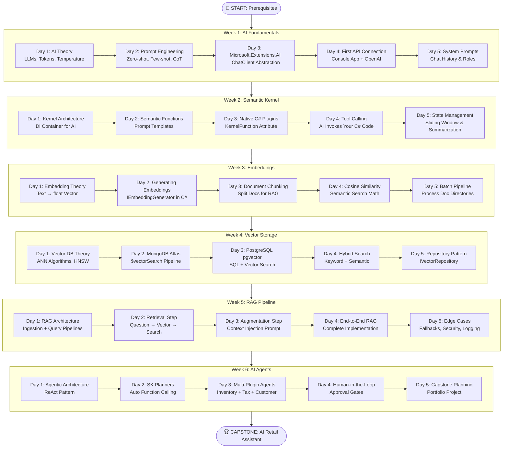

# 🗺️ Dotnet AI Engineer — Visual Roadmap

> **A strategic overview of the 6-week journey to mastering AI engineering within the .NET ecosystem.**

---

## The Complete Journey



---

## Technology Stack Map

```
┌──────────────────────────────────────────────────────────────────┐
│                    YOUR .NET AI APPLICATION                       │
│                                                                   │
│  ┌─────────────────────────────────────────────────────────────┐ │
│  │                    WEEK 6: AGENTS                            │ │
│  │  Semantic Kernel Planners, ReAct, Human-in-the-Loop          │ │
│  ├─────────────────────────────────────────────────────────────┤ │
│  │                    WEEK 5: RAG PIPELINE                      │ │
│  │  Retrieval → Augmentation → Generation → Validation          │ │
│  ├─────────────────────────────────────────────────────────────┤ │
│  │         WEEK 4: VECTOR STORAGE          │  WEEK 3: EMBEDDINGS│ │
│  │  MongoDB Atlas, pgvector, Hybrid Search │  Chunk, Embed,     │ │
│  │  Repository Pattern                     │  Cosine Similarity  │ │
│  ├─────────────────────────────────────────────────────────────┤ │
│  │                    WEEK 2: SEMANTIC KERNEL                   │ │
│  │  Kernel, Plugins, Semantic Functions, Tool Calling           │ │
│  ├─────────────────────────────────────────────────────────────┤ │
│  │                    WEEK 1: FUNDAMENTALS                      │ │
│  │  LLM Theory, Prompts, Microsoft.Extensions.AI, Chat Roles   │ │
│  └─────────────────────────────────────────────────────────────┘ │
│                                                                   │
│  ┌─────────────────────────────────────────────────────────────┐ │
│  │  FOUNDATION: .NET 8, C# 12, Azure/OpenAI, Docker            │ │
│  └─────────────────────────────────────────────────────────────┘ │
└──────────────────────────────────────────────────────────────────┘
```

---

## Key Skills Acquired

| Skill | Where Learned | Industry Relevance |
|-------|--------------|-------------------|
| LLM API integration | Week 1 | Every AI application |
| Prompt engineering | Week 1-2 | Core AI Engineering skill |
| AI orchestration (SK) | Week 2 | Enterprise AI apps |
| Plugin development | Week 2-3 | Extending AI capabilities |
| Embeddings | Week 3 | Search, recommendations |
| Vector databases | Week 4 | RAG, similarity search |
| RAG pipelines | Week 5 | #1 enterprise AI pattern |
| Agent development | Week 6 | Next-gen AI applications |
| Clean Architecture | Capstone | Production .NET |
| Security (HITL) | Week 6 | Enterprise safety |
